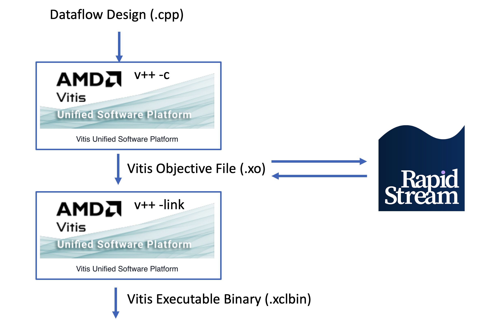

<!--
Copyright (c) 2024 RapidStream Design Automation, Inc. and contributors.  All rights reserved.
The contributor(s) of this file has/have agreed to the RapidStream Contributor License Agreement.
-->


# AMD Vitis Design

Rapidsteam is fully compatible with AMD Vitis by taking Vitis object files (`.xo`) as input, performing optimization and generating optimized `.xo` files as output. Therefore, users can use `v++ -link` to continue their Vitis development flow.



In this recipe, we demonstrate how to optimize a simple vector addition design in a Vitis object file (`.xo`), and use its output object file to continue the Vitis development flow.

## Xilinx Object Files

[Vitis compiled object files (`.xo`)](https://docs.amd.com/r/en-US/ug1393-vitis-application-acceleration/Design-Topology) are IP packages used in the AMD Vitis kernel development flow for programming the programmable logic (PL) region of target devices.

These files can be [generated from HLS C++ code](https://docs.amd.com/r/en-US/ug1393-vitis-application-acceleration/Developing-PL-Kernels-using-C) using the `v++` command, [packed from RTL code](https://docs.amd.com/r/en-US/ug1393-vitis-application-acceleration/RTL-Kernel-Development-Flow), or created using third-party frameworks like [TAPA](https://github.com/UCLA-VAST/tapa). In this example, we use `v++` to generate the `VecAdd.xo` file, but the same flow applies to object files generated through other methods.

## RapidStream for Vitis


The RapidStream flow for Vitis requires four key inputs:

1. **Device**: Specify the Vitis platform name for `v++`.
2. **Xilinx Object file** (.xo): Provide the file generated by `v++` or Vivado.
3. **Connectivity** (.ini): Include the configuration file for `v++`.
4. **Clock targets**: Define the desired clock frequencies.
5. RapidStream automatically handles all other aspects of the flow.

To execute the flow and generate optimized `.xo` files, run `rapidstream run.py` using the input from the `design` folder.

## Step 1: Generate the Xilinx Object File (`.xo`)

We use Vitis 2023.2 to generate the `.xo` file. Run the following command:

```bash
source <Vitis_install_path>/Vitis/2023.2/settings64.sh
cd <repo root>/getting_started/vitis_source
make xo
```


## Step 2: Call RapidStream to Optimize the Design


The RapidStream flow conducts design space exploration and generates optimized `.xo` files. Run the following command:

```bash
rapidstream ./run.py
```

You can locate these files using the following command:

```bash
find ./build -name *.xo
```

To examine the timing results for each design point, use this command:

```bash
find ./build -name *.xclbin.info
```

Next Step
---------
  **Click here to [go back to Getting Started](../README.md)**
